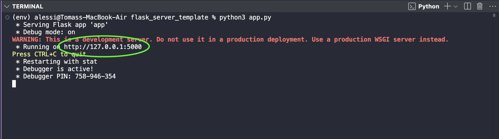

# A Minimal Flask Application


  ## How to set up?


  ### 1. Create and activate python environment:
  ```bash
  python3 -m venv env
  ```
  ```bash
  source env/bin/activate
  ```

  ### 2. Install flask requirement:
  ```bash
  pip install -r requirements.txt
  ```

  ### 3. Run app.py file:
  ```bash
 python3 app.py  
  ```

Your server should be running locally! Access the URL displayed in your terminal:





Pasting the URL in a web browser:


